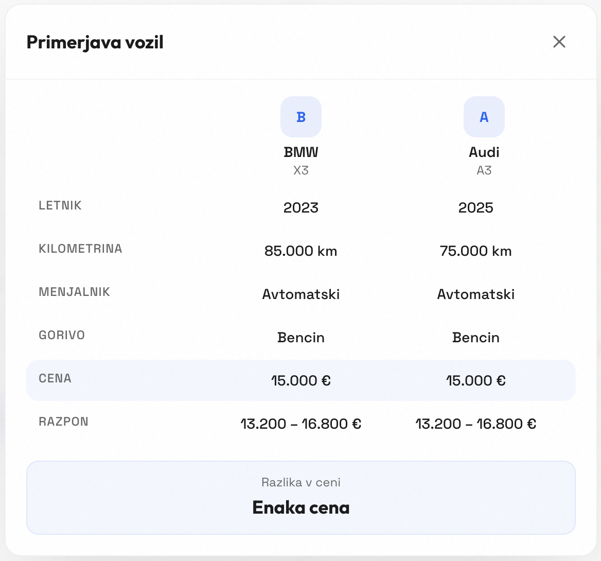

# **Sistem za hitro in enostavno oceno vrednosti rabljenih avtomobilov (AvtoCenilec)**

Ekipa 15: Niko Kralj, Miha Janežič, Zoja Jakopin, Lian Arl, Živa Lavrič

# **1 Uvod** 

## **1.2 Poudarki** 

Načrt za to iteracijo je bil pripraviti osnutek sistema in postaviti trdne temelje za nadaljnji razvoj projekta. Ekipa se je v tej fazi osredotočila predvsem na natančnejšo opredelitev potreb naročnika, dopolnitev funkcionalnih in nefunkcionalnih zahtev ter pripravo podrobnejšega opisa sistema. Pomemben del načrta je bil tudi oblikovanje uporabniških vlog, priprava primerov uporabe in izdelava diagrama primerov uporabe, saj ti elementi predstavljajo osnovo za kasnejšo implementacijo sistema. Poleg dokumentacijskega dela smo želeli pridobiti tudi boljši vpogled v javno podatkovno zbirko rabljenih avtomobilov z nemškega trga ter pripraviti začetni prototip uporabniškega vmesnika, ki bo služil kot osnova za nadaljnji razvoj aplikacije. V tej iteraciji smo načrtovali tudi posodobitev projektnega načrta ter pregled trenutnega stanja projekta, da bi lahko v naslednji fazi prešli na razvoj modela za napovedovanje cen in zalednega dela sistema.

Poleg dokumentacijskega dela smo izvedli začetno analizo podatkovne zbirke, s katero smo preverili strukturo podatkov, prisotnost manjkajočih oziroma neveljavnih vrednosti ter ocenili, kateri atributi bodo najpomembnejši za napovedovanje cene vozila. Izdelali smo tudi delujoč prototip uporabniškega vmesnika za vnos osnovnih podatkov o avtomobilu in izvedli osnovna testiranja vizualnega prikaza, odzivnosti ter pravilnosti vnosa podatkov. Ob tem smo posodobili projektni načrt, evidentirali spremembe v dnevniku sprememb in pripravili podlago za naslednjo iteracijo razvoja.

## **1.3 Spremembe**

V tej iteraciji smo zabeležili nekaj sprememb funkcionalnosti in načrta projekta. Odločili smo se, da bo spletna aplikacija omogočala tudi prijavo uporabnikov v sistem. Motivacija za to spremembo je bila želja, da bi prijavljenim uporabnikom omogočili shranjevanje preteklih iskanj in lažji pregled že pridobljenih ocen. Hkrati smo ohranili možnost uporabe sistema tudi brez prijave, saj želimo omogočiti hitro in enostavno uporabo za uporabnike, ki želijo le enkratno oceno vozila.

Prav tako smo se odločili odstraniti funkcionalnost prikaza vseh uporabljenih podatkov, saj smo ugotovili, da je ta funkcionalnost delno podvojena z izpisom najbolj vplivnih dejavnikov na ceno vozila. Sistem bo torej uporabniku prikazal ključne dejavnike, ki so najbolj vplivali na izračun cene, kar zagotavlja bolj pregledno in uporabno informacijo.

Na podlagi razprave v ekipi smo spremenili tudi prioriteto funkcionalnosti izpisa najbolj vplivnih dejavnikov iz *could have* na *should have*, saj smo ocenili, da ta funkcionalnost pomembno prispeva k razumevanju rezultatov in povečuje uporabno vrednost sistema.

Poleg funkcionalnih sprememb smo prilagodili tudi časovni načrt projekta. Aktivnost čiščenja podatkovne baze smo prestavili v tretjo iteracijo, ker so se druge aktivnosti v drugi iteraciji izkazale za zahtevnejše, kot smo sprva predvideli. V drugi iteraciji smo zato izvedli predvsem analizo podatkovne zbirke, kar nam bo omogočilo, da se bomo v naslednji iteraciji lahko osredotočili izključno na pripravo in čiščenje podatkov za učenje modela.

# **2 Potrebe naročnika** 

Naročnik potrebuje sodoben informacijski sistem, ki uporabnikom omogoča hitro, enostavno in zanesljivo oceno vrednosti rabljenega avtomobila. Namen sistema je nadomestiti zamuden postopek ročnega primerjanja oglasov ter uporabniku omogočiti bolj informirano odločitev pri nakupu ali prodaji vozila.

Rešitev mora biti zasnovana tako, da uporabniku omogoča vnos osnovnih podatkov o vozilu in na podlagi teh podatkov generira oceno njegove tržne vrednosti. Naročnik poudarja ne le funkcionalnost sistema, temveč predvsem kakovost uporabniške izkušnjem, zanesljivost delovanja, varnost in možnost nadaljnjega razvoja sistema.

Sistem mora biti enostaven za uporabo, dostopen širšemu krogu uporabnikov in zasnovan tako, da omogoča hitro prilagajanje spremembam na trgu ter nadgradnjo funkcionalnosti v prihodnosti.

## **2.1 Funkcionalne zahteve**

Funkcionalne zahteve sistema določajo ključne funkcionalnosti, ki jih mora sistem zagotavljati za uspešno delovanje. Sem spadajo vnos podatkov o vozilu, izračun ocene njegove vrednosti, prikaz rezultatov uporabniku ter obdelava napak pri vnosu podatkov. Sistem omogoča tudi razširitev funkcionalnosti, kot so shranjevanje podatkov, zgodovina iskanj in primerjava vozil. Podrobnejši opis posameznih funkcionalnosti je predstavljen v nadaljevanju.

## **2.2 Nefunkcionalne zahteve**

### **2.2.1 Zahteve izdelka**

#### **2.2.1.1 Odzivnost**

Sistem mora zagotoviti hitro odzivnost pri obdelavi zahtev. Izračun ocene vrednosti vozila mora biti izveden v manj kot 2 sekundah po oddaji podatkov. Nalaganje uporabniškega vmesnika ne sme trajati več kot 3 sekunde. Sistem mora omogočati sočasno uporabo vsaj 50 uporabnikom brez opaznega poslabšanja zmogljivosti. Posodabljanje podatkov mora potekati brez zamikov.

#### **2.2.1.2 Uporabnost**

Uporabniški vmesnik mora biti intuitiven in enostaven za uporabo. Uporabnik mora samostojno uporabljati sistem brez dodatnih navodil. Postopek vnosa podatkov in pridobitve rezultata ne sme trajati več kot 60 sekund.

#### **2.2.1.3 Zanesljivost**

Sistem mora zagotavljati pravilno delovanje v najmanj 99 % primerov. Ob napaki ne sme izgubiti podatkov in mora uporabniku prikazati ustrezno obvestilo. Pri enakih vhodnih podatkih mora vedno vrniti enak rezultat. Pravilno mora obravnavati nepopolne ali napačne vnose.

#### **2.2.1.4 Varnost**

Sistem mora zaščititi uporabniške podatke pred nepooblaščenim dostopom. Komunikacija med uporabnikom in sistemom mora biti varovana. Dostop do naprednih ali administrativnih funkcij mora biti omejen. Sistem ne sme razkrivati občutljivih informacij.

#### **2.2.1.5 Razpoložljivost**

Sistem mora biti na voljo vsaj 99 % časa. Načrtovani izpadi ne smejo trajati več kot eno uro. V primeru nedelovanja mora sistem prikazati obvestilo o napaki in predvidenem času odprave težave.

#### **2.2.1.6 Razširljivost**

Sistem mora omogočati povečanje števila uporabnikov brez vpliva na delovanje. Arhitektura mora omogočati enostavno dodajanje novih funkcionalnosti. Sistem mora podpirati rast količine podatkov brez zmanjšanja zmogljivosti.

#### **2.2.1.7 Združljivost**

Sistem mora delovati v vseh sodobnih spletnih brskalnikih. Podpirati mora uporabo na mobilnih napravah in računalnikih. Prikaz mora biti konsistenten na različnih napravah.

### **2.2.2 Organizacijske zahteve**

#### **2.2.2.1 Razvoj**

Sistem mora biti modularen in dokumentiran. Uporabiti je treba dobre razvojne prakse, ki omogočajo enostavno vzdrževanje.

#### **2.2.2.2 Vzdrževanje**

Sistem mora omogočati enostavno odpravljanje napak in posodabljanje. Spremembe morajo biti dokumentirane. Nadgradnje sistema ne smejo bistveno vplivati na delovanje obstoječih funkcionalnosti.

#### **2.2.2.3 Standardi**

Sistem mora biti razvit v skladu z uveljavljenimi standardi in smernicami za razvoj programske opreme. Uporabljene tehnologije morajo biti široko podprte in dolgoročno vzdržne.

### **2.2.3 Zunanje zahteve**

#### **2.2.3.1 Etične zahteve**

Uporabnik mora biti obveščen o uporabi svojih podatkov. Sistem mora omogočati transparentno obdelavo podatkov. Podatki se ne smejo uporabljati za namene, ki bi lahko škodovali uporabniku.

#### **2.2.3.2 Pravne zahteve**

Sistem mora biti skladen z zakonodajo o varstvu osebnih podatkov. Obdelava podatkov mora potekati v skladu z veljavnimi predpisi. Uporabniku mora biti omogočen vpogled v njegove podatke.

#### **2.2.3.3 Tehnološke zahteve**

Sistem mora delovati na standardnih platformah in ne sme biti odvisen od specifične strojne opreme. Omogočena mora biti integracija z drugimi sistemi v prihodnosti.

#  **3 Cilji projekta** 

**Naročnikove težave**

1\. Težko določanje realne vrednosti rabljenega avtomobila:

- Uporabniki težko ocenijo, koliko je vozilo dejansko vredno na trgu.  
- Cena vozila je odvisna od več dejavnikov, kot so znamka, model, letnik in število prevoženih kilometrov.  
- Brez ustreznega orodja je določanje primerne cene za uporabnika zahtevno.

2\. Zamudno ročno primerjanje oglasov:

- Kupci in prodajalci morajo trenutno sami pregledovati veliko število spletnih oglasov.  
- Takšen način iskanja informacij vzame veliko časa.  
- Ročno primerjanje oglasov je nepregledno in neučinkovito.

3\. Nezanesljive in netočne ocene:

- Primerjava oglasov ne zagotavlja nujno realne ocene vrednosti vozila.  
- Na trgu pogosto prihaja do razlik med dejansko vrednostjo vozila in ceno, ki jo določi prodajalec.  
- Uporabniki zato težko presodijo, ali je cena vozila primerna.

4\. Pomanjkanje enostavne in hitre rešitve:

- Uporabniki potrebujejo orodje, ki bi jim brez dolgotrajnega iskanja podalo okvirno oceno vrednosti vozila.  
- Prodajalci niso prepričani, kakšno ceno je smiselno postaviti.  
- Kupci težje sprejmejo informirano odločitev pri nakupu vozila.

**Koristi projekta**

1\. Hitra ocena vrednosti vozila:

- Sistem bo uporabniku omogočil, da po vnosu osnovnih podatkov hitro prejme okvirno oceno tržne cene.  
- Uporabnik bo do rezultata prišel bistveno hitreje kot z ročnim pregledovanjem oglasov.

2\. Prihranek časa:

- Uporabniku ne bo več treba samostojno pregledovati velikega števila spletnih ponudb.  
- Sistem bo oceno izračunal samodejno na podlagi vnesenih podatkov.

3\. Bolj informirano odločanje:

- Rešitev bo kupcem in prodajalcem pomagala pri lažji odločitvi pri nakupu ali prodaji vozila.  
- Uporabnik bo imel boljšo predstavo o tem, ali je cena vozila smiselna.

4\. Bolj realna in pregledna ocena:

- Ocena bo temeljila na podatkih iz javno dostopne zbirke rabljenih avtomobilov.  
- Sistem bo po možnosti poleg ocenjene cene prikazal tudi cenovni razpon.  
- Uporabnik bo lahko bolje razumel rezultat in realno vrednost vozila na trgu.

5\. Enostavna uporaba sistema:

- Sistem bo zasnovan kot preprosta in intuitivna spletna aplikacija.  
- Uporaben bo tudi za uporabnike brez večjega tehničnega znanja.  
- Vmesnik bo omogočal hitro in razumljivo uporabo.

## **3.1 Primeri uporabe** 

### **3.1.1 Slovar pojmov**

| Pojem | Opredelitev |
| ----- | ----- |
| **AvtoCenilec** | Ime našega sistema oziroma spletne aplikacije za hitro in enostavno oceno vrednosti rabljenih avtomobilov. |
| **Rabljeni avtomobil** | Vozilo, ki je bilo že uporabljeno in ga želimo  prodajati na trgu rabljenih vozil in zanj želimo izračunati njegovo ceno. V okviru projekta gre predvsem za vozila z nemškega trga. |
| **Tržna vrednost vozila** | Ocenjena cena, ki predstavlja približno vrednost vozila na trgu glede na njegove lastnosti in primerljivim podatkom |
| **Ocena vrednosti vozila** | Rezultat, ki ga sistem prikaže uporabniku po obdelavi vnesenih podatkov o vozilu, glede na primerljive avtomobile v naši podatkovni bazi. |
| **Cenovni razpon** | Interval okvirnih vrednosti vozila, ki ga sistem prikaže poleg ocenjene cene vozila, da uporabnik lažje razume realen razpon vrednosti vozila na trgu rabljenih vozil. |
| **Lastnosti vozila** |  Podatki o vozilu, ki ga uporabnik želi podati, na podlagi katerih sistem izvede napoved cene, na primer znamka, model, letnik, prevoženi kilometri, tip goriva in menjalnik.  |
| **Registriran uporabnik** | Uporabnik z ustvarjenim računom, ki ima poleg osnovnega izračuna na voljo tudi dodatne funkcionalnosti, kot so shranjevanje preteklih iskanj in primerjava vozil. |
| **Gost** | Neprijavljen uporabnik sistema, ki lahko brez ustvarjenega računa vnese podatke o vozilu in pridobi osnovno oceno njegove vrednosti |
| **Administrator** | Uporabniška vloga z naprednimi pravicami, namenjena vzdrževanju sistema, pripravi podatkov in učenju modela za napovedovanje cen. |
| **Javna podatkovna zbirka** |  Zunanji vir podatkov o rabljenih avtomobilih, iz katerega administrator pridobiva podatke za analizo, čiščenje in učenje modela.  |
| **Linearni regresijski model** | Model strojnega učenja, ki ga sistem uporablja za napovedovanje tržne vrednosti rabljenega avtomobila. Model se nauči iz preteklih podatkov o vozilih in njihovih cenah ter na podlagi vnesenih lastnosti vozila izračuna njegovo približno vrednost. V našem sistemu predstavlja osrednji del logike za ocenjevanje cene avtomobila. |
| **Učenje modela** | Postopek, pri katerem sistem na podlagi očiščenih in pripravljenih podatkov zgradi model za napovedovanje cen rabljenih avtomobilov. V tej fazi se model nauči povezav med lastnostmi vozila in njegovo tržno vrednostjo. |
| **Naučen model** | Model, ki je bil že uspešno naučen na pripravljenih podatkih in je pripravljen za uporabo v sistemu. Sistem ga uporabi pri izračunu ocene vrednosti vozila na podlagi podatkov, ki jih vnese uporabnik. |
| **Napovedovanje cene** | Izračun približne tržne vrednosti vozila na podlagi vnesenih lastnosti in naučenega modela. |
| **Prijava v sistem** | Funkcionalnost, ki prijavljenemu uporabniku omogoča dostop do dodatnih možnosti sistema, kot so pretekla iskanja in primerjava med avtomobili. |
| **Pretekla iskanja** | Seznam predhodno izvedenih ocen vozil, ki jih lahko registriran uporabnik shrani in kasneje pregleda. |
| **Primerjava med avtomobili** | Funkcionalnost, ki prijavljenemu uporabniku omogoča sočasen prikaz ocen več vozil na enem zaslonu. |
| **Najbolj vplivni dejavniki** | Lastnosti vozila, ki so najbolj vplivale na izračun ocene cene in jih sistem lahko prikaže uporabniku kot razlago rezultata, ki ga dobi po izračunu. |

### **3.1.2. Uporabniške vloge**

V sistemu za oceno vrednosti rabljenih vozil smo identificirali tri glavne uporabniške vloge: gost, resgistriran uporabnik in administrator. Vloge se med seboj razlikujejo glede na pravice in funkcionalnosti, ki so jim na voljo. 

**Gost** predstavlja neprijavljenega uporabnika sistema. To je tipično uporabnik, ki želi hitro in brez ustvarjanja računa preveriti okvirno vrednost rabljenega vozila. Njegov glavni namen uporabe sistema je pridobitev osnovne informacije o ocenjeni tržni ceni avtomobila na podlagi vnesenih podatkov.  
Gost lahko v sistem vnese osnovne podatke o vozilu. Sistem nato preveri pravilnost vnosa podatkov in izvede izračun ocenjene cene vozila z uporabo naučenega modela. Sistem nato gostu predstavi rezultat izračuna. Prikaže mu lahko tudi dodatne informacije, kot so cenovni razpon vozila ter najpomembnejši dejavniki, ki so vplivali na izračun ocenjene cene. Gost ima prav tako možnost ponastavitve obrazca, kar mu omogoča hitro ponovno uporabo sistema za drugo vozilo.  
Poleg tega ima gost možnost prijave v sistem, s čimer lahko pridobi dodatne funkcionalnosti, ki so na voljo registriranim uporabnikom.

**Registriran uporabnik** je uporabnik, ki ima ustvarjen uporabniški račun in je prijavljen v sistem. Poleg vseh funkcionalnosti, ki so na voljo gostu, ima registriran uporabnik dostop tudi do dodatnih funkcionalnosti, ki izboljšujejo uporabniško izkušnjo in omogočajo bolj poglobljeno analizo ocen vozil.  
Registriran uporabnik lahko shranjuje pretekle izračune ocen vozil, kar mu omogoča kasnejši pregled brez ponovnega vnosa podatkov. Poleg tega lahko primerja več vozil med seboj, kar mu pomaga pri odločanju o nakupu ali prodaji.   
Ta vloga je namenjena uporabnikom, ki sistem uporabljajo pogosteje ali želijo bolj napredne funkcionalnosti za podporo pri odločanju.

**Administrator** predstavlja vlogo z najvišjimi pravicami v sistemu. Poleg vseh funkcionalnosti, ki so na voljo prijavljenim uporabnikom, ima administrator dostop tudi do funkcionalnosti, ki so povezane z vzdrževanjem sistema in razvojem modela za napovedovanje cen.  
Administrator lahko izvaja pripravo podatkov za učenje modela, kar vključuje čiščenje podatkov, odstranjevanje neveljavnih zapisov ter pripravo ustreznega podatkovnega nabora za učenje. Poleg tega lahko administrator sproži proces učenja modela za napovedovanje cen vozil na podlagi pripravljene podatkovne zbirke.  
Ta vloga je namenjena razvijalcem ali skrbnikom sistema, ki skrbijo za pravilno delovanje modela, njegovo posodabljanje ter kakovost podatkov, na katerih temelji napovedovanje cen. Administrator s tem zagotavlja, da sistem ostaja zanesljiv in da so napovedi cen čim bolj natančne.

### **3.1.3. Seznam primerov uporabe**

### **PU-01: Prijava v sistem**

**Akterji:** Registriran uporabnik/administrator

**Povzetek funkcionalnosti:** Uporabnik se lahko s svojim uporabniškim imenom in geslom prijavi v sistem.

**Osnovni tok:**

1. Uporabnik odpre obrazec za prijavo v sistem.  
2. Če uporabnik še nima računa mu je ponujena možnost registracije.  
3. Uporabnik vnese svoje uporabniško ime in geslo.  
4. Uporabnik odda obrazec.  
5. Sistem preveri ali so polja izpolnjena.  
6. Sistem preveri podatke v podatkovni bazi.  
7. Sistem uporabnika prijavi v njegov račun.  
8. Sistem preusmeri uporabnika na glavno stran.

**Alternativni tokovi:**

Alternativni tok 1: 

Sistem zazna napačne podatke zato prikaže napako. Uporabniku omogoči ponoven vnos podatkov.

Alternativni tok 2: 

Sistem zazna prazna polja zato prikaže napako.

Alternativni tok 3:

Uporabnik med prijavo pozabi svoje uporabniško ime ali geslo. Omogočena mu je ponastavitev gesla preko e-maila.

**Predpogoji:** 

Sistem je dosegljiv, uporabnikov račun obstaja.

**Podpogoji (posledice, učinki):** 

Uporabnik je prijavljen v svoj račun in lahko dostopa do shranjenih podatkov. Uporabnik je preusmerjen na glavno stran.

**Posebne zahteve:** Ni.

**Prioriteta:** Must have. Gre za eno izmed glavnih funkcionalnosti sistema.

**Sprejemni testi:**

| Primer uporabe | Funkcija, ki se testira | Začetno stanje sistema | Vhod | Pričakovan rezultat |
| :---- | :---- | :---- | :---- | :---- |
| Prijava v sistem | Pravilna prijava v sistem | Vnosna polja so prazna | Pravilno uporabniško ime in geslo | Uporabnik je uspešno prijavljen v sistem in preusmerjen na glavno stran. |
| Prijava v sistem | Prijava z napačnimi podatki | Vnosna polja so prazna | Napačno uporabniško ime ali geslo | Sistem prikaže napako in uporabniku omogoči ponoven vnos podatkov |
| Prijava v sistem | Prijava brez vnosa podatkov | Vnosna polja so prazna | Nič | Sistem uporabnika opozori, da mora vnesti podatke o računu |
| Prijava v sistem | Ponastavitev gesla računa | Vnosna polja so prazna | Zahteva po ponastavitvi gesla | Sistem uporabniku omogoči ponastavitev gesla s pomočjo e-pošte |

**Razširitve, pogostost uporabe**

Ne zahteva posebnih razširitev.

 

### **PU-02: Vnos osnovnih podatkov o avtomobilu**

**Akterji:** Gost/ registriran uporabnik/ administrator

**Povzetek funkcionalnosti:** Uporabnik lahko v spletni obrazec vnese osnovne podatke o avtomobilu, kot so znamka, model, letnik in število prevoženih kilometrov.

**Osnovni tok:**

1. Uporabnik odpre obrazec za oceno avtomobila.  
2. Uporabnik vnese vse zahtevane podatke.  
3. Uporabnik odda obrazec.  
4. Sistem prevzame podatke   
5. Tukaj se izvede: PU-03: preverjanje pravilnosti vnosa.

**Alternativni tokovi:**

Alternativni tok 1: 

Uporabnik pusti eno ali več obveznih polj praznih. Brez obveznih parametrov sistem ni sposoben izračunati ocene.

Alternativni tok 2:

Uporabnik vnese neveljaven podatek (npr. negativne kilometre). Zaradi neveljavnih podatkov sistem ni sposoben izračunati ocene. 

**Predpogoji:** 

Sistem je dosegljiv, uporabnik je na strani za oceno avtomobila.

**Podpogoji (posledice, učinki):** 

Podatki so pripravljeni za preverjanje in nadaljnji izračun.

**Posebne zahteve:** Obrazec mora biti pregleden, razumljiv in odziven.

**Prioriteta:** Must have. Gre za eno izmed glavnih funkcionalnosti sistema.

**Sprejemni testi:**

| Primer uporabe | Funkcija, ki se testira | Začetno stanje sistema | Vhod | Pričakovan rezultat |
| :---- | :---- | :---- | :---- | :---- |
| Vnos osnovnih podatkov o avtomobilu | Vnašanje podatkov | Vnosna polja so prazna | Podatki o avtomobilu | Vsa obvezna polja v obrazcu so izpolnjena |

**Razširitve, pogostost uporabe**

Ne zahteva posebnih razširitev.

### **PU-03: Preverjanje pravilnosti vnosa**

**Akterji:** Gost/ registriran uporabnik/ administrator

**Povzetek funkcionalnosti:** Uporabnik lahko prejme opozorilo ob napačnem vnosu podatkov, da lahko podatke popravi pred izračunom ocene.

**Osnovni tok:**

1. Sistem prejme vnešene podatke.  
2. Sistem preveri ali so vnešeni vsi obvezni podatki.  
3. Sistem preveri tipe podatkov.  
4. Sistem preveri vrednostne omejitve podatkov.  
5. Sistem potrdi ali zavrne podatke.

**Alternativni tokovi:**

Alternativni tok 1: 

Uporabnik pusti eno ali več obveznih polj praznih. Brez obveznih parametrov sistem ni sposoben izračunati ocene. Sistem uporabnika opozori, da je potrebno vnesti preostale obvezne podatke.

Alternativni tok 2:

Uporabnik vnese tekstovni podatek v vnosno polje kjer so pričakovana števila (npr. število prevoženih kilometrov). Zaradi neveljavnih podatkov sistem ni sposoben izračunati ocene. Sistem uporabnika opozori, da je potrebno popraviti napačne podatke. 

Alternativni tok 3:

Uporabnik vnese število, ki ni logično v vnosno polje kjer so pričakovana števila (Npr. vnese negativne kilometre). Zaradi neveljavnih podatkov sistem ni sposoben izračunati ocene. Sistem uporabnika opozori, da je potrebno popraviti napačne podatke.

**Predpogoji:** 

Sistem je dosegljiv, uporabnik je na strani za oceno avtomobila.

**Podpogoji (posledice, učinki):** 

Podatki so preverjeni in se jih lahko uporabi za napoved cene.

**Posebne zahteve:** Ni.

**Prioriteta:** Must have. Gre za eno izmed glavnih funkcionalnosti sistema.

| Primer uporabe | Funkcija, ki se testira | Začetno stanje sistema | Vhod | Pričakovan rezultat |
| :---- | :---- | :---- | :---- | :---- |
| Preverjanje pravilnosti vnosa | Prisotnost vseh obveznih podatkov | Vsa vnosna polja so izpolnjena | Vsi obvezni podatki o avtomobilu | Podatki so potrjeni  |
| Preverjanje pravilnosti vnosa | Pravilnost formatov | Vsa vnosna polja so izpolnjena | Tekstovni zapis v polju za številčne zapise | Podatki so zavrnjeni |
| Preverjanje pravilnosti vnosa | Pravilnost rangov | Vsa vnosna polja so izpolnjena | Nerealistična vrednost v polju za številčne zapise | Podatki so zavrnjeni |
| Preverjanje pravilnosti vnosa | Preverjanje ali je model avtomobila možno oceniti | Vsa vnosna polja so izpolnjena | Model avtomobila, za katerega model ni sposoben napovedati ocene cene | Podatki so zavrnjeni |

**Razširitve, pogostost uporabe**

Ne zahteva posebnih razširitev.

### **PU-04: Izračun ocene cene avtomobila z modelom**

**Akterji:** Gost/ registriran uporabnik/ administrator  
**Povzetek funkcionalnosti:** Model lahko na podlagi vnesenih podatkov izračuna ocenjeno tržno vrednost avtomobila.

**Osnovni tok:**

1. Sistem prejme preverjene podatke.  
2.  Sistem pošlje podatke modelu.  
3.  Model izračuna oceno.  
4.  Sistem prejme in preveri rezultat.  
5.  Sistem pripravi prikaz rezultata za uporabnika.

**Alternativni tokovi:**

Alternativni tok 1: 

Podatki niso uspešno posredovani modelu, ki posledično ne more izračunati ocene cene.

Alternativni tok 2: 

Model ni dosegljiv in zato ni sposoben izračunati ocene.

Alternativni tok 3:

Model vrne napačno predikcijo(na primer negativno ceno). 

**Predpogoji:** Vnešeni podatki so preverjeni.

**Podpogoji:** Ocena cene avtomobila je izračunana.

**Posebne zahteve:** Izračun mora trajati manj kot 3 sekunde.

**Prioriteta MoSCoW:** Must have. Gre za eno izmed glavnih funkcionalnosti sistema.

**Sprejemni testi:** 

| Primer uporabe | Funkcija, ki se testira | Začetno stanje sistema | Vhod  | Pričakovan rezultat |
| :---- | :---- | :---- | :---- | :---- |
| Izračun ocene cene avtomobila | Posredovanje preverjenih podatkov modelu | Vnešene podatke je sistem preveril in potrdil | Preverjeni podatki o avtomobilu | Preverjeni podatki so posredovani modelu |
| Izračun ocene cene avtomobila | Dostopnost modela | Vnešene podatke je sistem preveril in potrdil | Zahteva izračuna | Model je odziven |
| Izračun ocene cene avtomobila | Veljavnost rezultata | Model izračuna oceno cene avtomobila | Ocena cene avtomobila | Ocena je potrjena, če ni negativna |
| Izračun ocene cene avtomobila | Hitrost izračuna | Model prejme preverjene podatke | Zahteva za izračun | Model izračuna oceno dovolj hitro oziroma poda timeout napako če račun poteka prepočasi |

**Razširitve, pogostost uporabe**

Ne zahteva posebnih razširitev.

### **PU-05: Prikaz ocenjene cene avtomobila**

**Akterji:** Gost/ registriran uporabnik/ administrator

**Povzetek funkcionalnosti:** Uporabniku lahko sistem prikaže ocenjeno vrednost avtomobila, na podlagi vnešenih podatkov.

**Osnovni tok:**

1. Tukaj se izvede: PU-04: Izračun ocene cene avtomobila z modelom  
2. Sistem prejme rezultat izračuna.  
3. Sistem uporabniku prikaže oceno cene avtomobila.  
4. Sistem preveri ali je uporabnik označil, da želi videti tudi razpon cene (checkbox 1).  
5. Razširitvena točka 1 :Ali je checkbox 1 označen? (pogoj): PU-06: Prikaz cenovnega razpona.  
6. Sistem preveri ali je uporabnik označil, da želi videti kateri parametri najbolj vplivajo na ocenjeno ceno (checkbox 2).  
7. Razširitvena točka 2: Ali je checkbox 2 označen? (pogoj): PU-07: Izpis najbolj vplivnih dejavnikov.

**Alternativni tokovi:**

Alternativni tok 1: 

Model ni uspešno izračunal ocene in posledično sistem ne more prikazati rezultata.

**Predpogoji:** Uspešno izveden račun ocene.

**Podpogoji:** Uporabnik prejme rezultat.

**Posebne zahteve:** Prikaz mora biti pregleden.

**Prioriteta:** Must have. Gre za eno izmed glavnih funkcionalnosti sistema.

**Sprejemni testi:**

| Primer uporabe | Funkcija, ki se testira | Začetno stanje sistema | Vhod  | Pričakovan rezultat |
| :---- | :---- | :---- | :---- | :---- |
| Prikaz rezultatov | Prikaz ocene | Ocena obstaja | Zahteva za prikaz | Prikaže se cena |
| Prikaz rezultatov | Prikaz ocene | Ocena ne obstaja | Zahteva za prikaz | Sistem obvesti uporabnika o napaki |

**Razširitve, pogostost uporabe**

Ne zahteva posebnih razširitev.

### **PU-06: Prikaz cenovnega razpona**

**Akterji:** Gost/ registriran uporabnik/ administrator  
**Povzetek funkcionalnosti:** Uporabnik lahko vidi cenovni razpon vrednosti vozila.

**Osnovni tok:**

1. Uporabnik na obrazcu za oceno avtomobila označi, da želi videti tudi razpon cene.  
2. Sistem preveri ali obstaja ocena cene.  
3. Sistem na podlagi izračuna ocene določi razpon primerne cene avtomobila.  
4. Sistem prikaže razpon.

**Alternativni tokovi:**

Alternativni tok 1: 

Ne obstaja ocena cene avtomobila, zato sistem ne more določiti razpona.

**Predpogoji:** Uspešno izveden račun ocene.

**Podpogoji:** Uporabnik prejme poleg točne ocene tudi interval primerne cene.

**Posebne zahteve:** Prikaz mora biti pregleden.

**Prioriteta:** Should have. Gre za funkcionalnost, ki je pomembna vendar ni nujna.

**Sprejemni testi:**

| Primer uporabe | Funkcija, ki se testira | Začetno stanje sistema | Vhod  | Pričakovan rezultat |
| :---- | :---- | :---- | :---- | :---- |
| Prikaz cenovnega razpona | Izračun razpona | Ocena obstaja | Podatki o oceni | Izračunan razpon |
| Prikaz cenovnega razpona | Prikaz razpona | Razpon je izračunan | Zahteva za prikaz | Razpon je prikazan uporabniku |

**Razširitve, pogostost uporabe**

Ne zahteva posebnih razširitev.

### **PU-07: Izpis najbolj vplivnih dejavnikov**

**Akterji:** Gost/ registriran uporabnik/ administrator  
**Povzetek funkcionalnosti:** Uporabnik lahko vidi, kateri dejavniki so najbolj vplivali na izračun ocene.

**Osnovni tok:**

1. Uporabnik na obrazcu za oceno avtomobila označi, da želi najbolj vplivne dejavnike.  
2. Sistem preveri ali obstaja ocena cene.  
3. Sistem na podlagi izračuna ocene določi najbolj vplivne dejavnike.  
4. Sistem prikaže najbolj vplivne dejavnike.

**Alternativni tokovi:**

Alternativni tok 1:

Ne obstaja ocena cene avtomobila, zato sistem ne more določiti najvplivnejših dejavnikov.

**Predpogoji:** Model je uspešno izračunal oceno cene avtomobila na podlagi podanih podatkov.

**Podpogoji:** Sistem uporabniku posreduje informacijo o podatkih, ki so najbolj vplivali na ocenjeno ceno.

**Posebne zahteve:** Ni.

**Prioriteta:** Should have. Gre za funkcionalnost, ki je pomembna vendar ni nujna.

**Sprejemni testi:**

| Primer uporabe | Funkcija, ki se testira | Začetno stanje sistema | Vhod  | Pričakovan rezultat |
| :---- | :---- | :---- | :---- | :---- |
| Izpis najbolj vplivnih dejavnikov | Pridobitev najbolj vplivnih dejavnikov | Ocena obstaja | Podatki o oceni | Seznam najbolj vplivnih dejavnikov |
| Izpis najbolj vplivnih dejavnikov | Prikaz najbolj vplivnih dejavnikov | Sistem je določil dejavnike | Zahteva za prikaz | Uporabniku sistem prikaže dejavnike |

**Razširitve, pogostost uporabe**

Ne zahteva posebnih razširitev.

### **PU-08: Ponastavitev obrazca za vnos podatkov o avtomobilu**  
**Akterji:** Gost/ registriran uporabnik/ administrator  
**Povzetek funkcionalnosti:** Uporabnik lahko ponastavi obrazec za vnos podatkov, da lahko vnese druge podatke.

**Osnovni tok:**

1. Uporabnik klikne na gumb za ponastavitev podatkov.  
2. Sistem preveri ali so podatki vneseni.  
3. Sistem ponastavi podatke.  
4. Sistem prikaže prazna polja.

**Alternativni tokovi:**

Alternativni tok 1: 

Uporabnik želi ponastaviti obrazec vendar je ta že prazen. Sistem zazna da ni podatkov zato ne izvede akcije.

**Predpogoji:** Sistem je dosegljiv, uporabnik je na strani za oceno avtomobila.

**Podpogoji:** Vnešeni podatki se odstranijo, polja za vnos so prazna.

**Posebne zahteve:** Ni

**Prioriteta:** Should have. Gre za funkcionalnost, ki je pomembna vendar ni nujna.

**Sprejemni testi:**

| Primer uporabe | Funkcija, ki se testira | Začetno stanje sistema | Vhod  | Pričakovan rezultat |
| :---- | :---- | :---- | :---- | :---- |
| Ponastavitev obrazca za vnos podatkov | Ponastavitev podatkov | Vnosna polja so izpolnjena | Zahteva za ponastavitev | Vnosna polja so prazna |
| Ponastavitev obrazca za vnos podatkov | Ponastavitev podatkov | Vnosna polja so prazna | Zahteva za ponastavitev | Vnosna polja ostanejo prazna |

**Razširitve, pogostost uporabe**

Ne zahteva posebnih razširitev.

### **PU-09: Priprava podatkov za učenje modela**  
**Akterji:** administrator,  javna podatkovna zbirka  
**Povzetek funkcionalnosti:** Administrator lahko pridobi podatke iz javne podatkovne zbirke ter jih očisti in pripravi za učenje modela.

**Osnovni tok:**

1. Administrator prevzame podatke o avtomobilih iz javne podatkovne baze.  
2. Administrator podatke pregleda in izloči nepopolne ali napačne vnose.

**Alternativni tokovi:**

Alternativni tok 1: 

Javna podatkovna baza ni dostopna. Administrator ne more pridobiti podatkov, zato se postopek prekine.

Alternativni tok 2: 

Podatki vsebujejo preveč manjkajočih ali napačnih vrednosti. Administrator mora dodatno očistiti podatke ali poiskati drug vir.

Alternativni tok 3: 

Napaka pri uvozu podatkov v sistem. Podatki niso pravilno shranjeni.

**Predpogoji:** Javna podatkovna baza je dostopna administratorju.

**Podpogoji:** Podatki so urejeni in na voljo modelu za računanje ocen.

**Posebne zahteve:** Ni

**Prioriteta:** Must have. Gre za eno izmed glavnih funkcionalnosti sistema.

**Sprejemni testi:**

| Primer uporabe | Funkcija, ki se testira | Začetno stanje sistema | Vhod  | Pričakovan rezultat |
| :---- | :---- | :---- | :---- | :---- |
| Priprava podatkov za učenje modela | Pridobivanje podatkov | Sistem nima podatkov | Podatki iz javne baze | Podatki so uspešno pridobljeni |
| Priprava podatkov za učenje modela | Čiščenje podatkov | Podatki vsebujejo napake | Podatki z napakami | Neveljavni zapisi so odstranjeni |
| Priprava podatkov za učenje modela | Shranjevanje podatkov | Podatki so očiščeni | Očiščeni podatki | Podatki so shranjeni in pripravljeni za uporabo |

**Razširitve, pogostost uporabe**

Ne zahteva posebnih razširitev.

### **PU-10: Učenje modela za napovedovanje cen**  
**Akterji:** administrator  
**Povzetek funkcionalnosti:** Administrator lahko na očiščenih podatkih izvede učenje modela, da sistem omogoča napoved cene vozila na podlagi njegovih lastnosti.

**Osnovni tok:**

1. Administrator zažene proces učenja modela  
2. Sistem naloži pripravljene podatke  
3. Sistem izvede učenje modela  
4. Sistem preveri uspešnost modela  
5. Sistem shrani naučen model

**Alternativni tokovi:**

Alternativni tok 1: 

Podatki niso na voljo, sistem ne more začeti učenja.

Alternativni tok 2: 

Napaka med učenjem modela proces se prekine

Alternativni tok 3: 

Model doseže slabo natančnost, administrator mora izboljšati podatke ali parametre

**Predpogoji:** Na voljo je pripravljena in očiščena podatkovna zbirka za učenje modela.

**Podpogoji:** Model je uspešno naučen, preverjen in shranjen za nadaljnjo uporabo pri napovedovanju cen vozil. 

**Posebne zahteve:** Ni

**Prioriteta:** Must have. Gre za eno izmed glavnih funkcionalnosti sistema.

**Sprejemni testi:**

| Primer uporabe | Funkcija, ki se testira | Začetno stanje sistema | Vhod  | Pričakovan rezultat |
| :---- | :---- | :---- | :---- | :---- |
| Učenje modela za napovedovanje cen | Zagon učenja | Podatki obstajajo | Zahteva za učenje | Učenje se začne |
| Učenje modela za napovedovanje cen | Uspešnost modela | Model se uči | Testni vhod | Model doseže sprejemljivo natančnost |
| Učenje modela za napovedovanje cen | Shranjevanje modela | Model je naučen | Model | Model je shranjen |

**Razširitve, pogostost uporabe**

Ne zahteva posebnih razširitev.

### **PU-11: Shranjevanje preteklih iskanj**

**Akterji:** Registriran uporabnik/ administrator  
**Povzetek funkcionalnosti:** Uporabnik lahko pregleda pretekla ocene vozil, brez ponovnega vnosa podatkov.

**Osnovni tok:**

1. Ko sistem uporabniku poda oceno cene za vnešene podatke o avtomobilu, lahko uporabnik rezultat shrani.  
2. Sistem rezultat shrani v podatkovno bazo, kjer so shranjena vse pretekle ocene.

**Alternativni tokovi:**

Alternativni tok 1: 

Uporabnik ni prijavljen, sistem ne omogoči shranjevanja in zahteva prijavo.

Alternativni tok 2: 

Napaka pri shranjevanju podatkov, sistem prikaže obvestilo o napaki.

**Predpogoji:** Uporabnik je prijavljen v svoj račun. Sistem uspešno izračuna in uporabniku poda oceno cene avtomobila.

**Podpogoji:** Ocena cene avtomobila, ki jo je sistem podal se shrani v podatkovno bazo.

**Posebne zahteve:** Ni

**Prioriteta:** Could have. Funkcionalnost je zaželena, vendar verjetno ne bo pretirane škode, če jo izpustimo.

**Sprejemni testi:**

| Primer uporabe | Funkcija, ki se testira | Začetno stanje sistema | Vhod  | Pričakovan rezultat |
| :---- | :---- | :---- | :---- | :---- |
| Shranjevanje preteklih iskanj | Shranjevanje podatkov | Uporabnik je prijavljen  | Zahteva za shranjevanje | Podatki se uspešno shranijo |
| Shranjevanje preteklih iskanj | Shranjevanje brez prijave | Uporabnik ni prijavljen | Zahteva za shranjevanje | Sistem zahteva prijavo |
| Shranjevanje preteklih iskanj | Napaka pri shranjevanju | Sistem deluje | Zahteva za shranjevanje | Sistem prikaže napako |

**Razširitve, pogostost uporabe**

Ne zahteva posebnih razširitev.

### **PU-12: Primerjava med avtomobili**

Akterji: Registriran uporabnik/ administrator  
**Povzetek funkcionalnosti:** Uporabnik lahko primerja ocene več vozil hkrati, da se lažje odloči med različnimi možnostmi.

**Osnovni tok:**

1. Uporabnik odpre seznam shranjenih vozil  
2. Uporabnik izbere vsaj dve vozili za primerjavo?  
3. Uporabnik sproži primerjavo?  
4. Sistem prikaže podatke vozil vzporedno  
5. Uporabnik pregleda rezultate primerjave  
   

**Alternativni tokovi:**

Alternativni tok 1: 

Uporabnik izbere mank kot dve vozili, sistem pokaže obvestilo.

Alternativni tok 2: 

Podatki o vozilih niso na voljo, sistem ne mora izvesti primerjave.

Alternativni tok 3: 

Napaka pri prikazu primerjave, sistem prikaže obvestilo o napaki

**Predpogoji:** Uporabnik je prijavljen v svoj račun in ima shranjeni vsaj dve pretekli iskanji.

**Podpogoji:** Uporabnik lahko primirja svoje pretekle rezultate. 

**Posebne zahteve:** Ni

**Prioriteta:** Could have. Funkcionalnost je zaželena, vendar verjetno ne bo pretirane škode, če jo izpustimo.

**Sprejemni testi:**

| Primer uporabe | Funkcija, ki se testira | Začetno stanje sistema | Vhod  | Pričakovan rezultat |
| :---- | :---- | :---- | :---- | :---- |
| Primerjava med avtomobili | Izbor vozil | Uporabnik ima shranjena vozila | Izbor več vozil | Vozila so izbrana |
| Primerjava med avtomobili | Prikaz primerjave | Vozila so izbrana | Zahteva za primerjavo | Sistem pokaže primerjavo |
| Primerjava med avtomobili | Nezadostno število vozil | Uporabnik izbere eno vozilo | Zahteva za primerjavo | Sistem prikaže opozorilo |

**Razširitve, pogostost uporabe**

Ne zahteva posebnih razširitev.

### **3.1.4. Diagram primerov uporabe**  
 
**Diagram primerov uporabe** (izvorna koda :bar_chart: [PlantUML](./gradivo/plantuml/UseCaseDiagram.puml))
# **4 Opis sistema** 

Sistem je spletna aplikacija, katere namen je slovenskemu uporabniku omogočiti hitro in enostavno oceno tržne vrednosti rabljenega avtomobila na nemškem trgu. Sistem nadomesti zamudno ročno primerjanje oglasov in uporabniku hitro poda oceno vrednosti vozila, kar mu olajša odločitev pri nakupu ali prodaji.

**Administrator skrbi za pripravo in vzdrževanje sistema. Njegove naloge vključujejo:**

- Priprava podatkov za učenje modela (PU-09): Administrator pridobi podatke iz javne podatkovne zbirke rabljenih avtomobilov z nemškega trga, jih očisti (odstrani nepravilne zapise, uredi manjkajoče vrednosti) in pripravi za učenje modela  
- Učenje modela za napovedovanje cen (PU-10): Administrator na očiščenih podatkih izvede postopek učenja linearnega regresijskega modela, da lahko sistem napove ceno vozila na podlagi njegovih lastnosti.

**Ko je model naučen in sistem vzpostavljen, lahko uporabnik izkoristi naslednje funkcionalnosti:**

- Prijava v sistem (PU-01): Uporabnik se lahko preko obrazca prijavi v sistem.  
- Vnos osnovnih podatkov o vozilu (PU-02): Uporabnik v spletni obrazec vnese podatke o vozilu, kot so znamka, model, letnik, tip menjalnika, tip goriva in število prevoženih kilometrov. Obrazec je zasnovan tako, da je uporaba enostavna za uporabnike brez tehničnega znanja.  
- Preverjanje pravilnosti vnosa (PU-03): Sistem ob oddaji obrazca preveri pravilnost vnesenih podatkov in uporabnika opozori na morebitne napake ali manjkajoče vrednosti, preden izvede račun.  
- Izračun ocene cene vozila (PU-04): Po uspešnem opravljenem preverjanju sistem posreduje podatke zalednemu strežniku, ki jih preda naučenemu modelu. Model na podlagi vnesenih lastnosti izračuna ceno vrednosti vozila.  
- Prikaz rezultatov ocene cene avtomobila (PU-05): Sistem uporabniku prikaže vrednost vozila v pregledni obliki.  
- Prikaz cenovnega razpona (PU-06): Poleg cene sistem prikaže tudi cenovni razpon, kar uporabniku omogoča boljše razumevanje realnega razpona vrednosti vozila na trgu.  
- Izpis najbolj vplivnih dejavnikov (PU-07): Sistem prikaže, kateri dejavniki so imeli največji vpliv na izračunano oceno, kar uporabniku olajša razumevanje rezultata.  
- Ponastavitev obrazca (PU-08): Uporabnik lahko kadarkoli ponastavi obrazec in vnese podatke za drugo vozilo, brez da bi ponovno naložil stran.  
- Pregled preteklih iskanj (PU-11): Uporabnik lahko pregleda seznam že izvedenih ocen, brez da bi izvajal ponovne zahteve.  
- Primerjava med avtomobili (PU-12): Uporabnik lahko izbere več že ocenjenih vozil in jih primerja na enem zaslonu, kar olajša odločitev med njimi.

Celotna komunikacija poteka tako, da uporabnik preko spletne vmesnika pošlje zahtevo zalednemu strežniku, ki podatke posreduje naučenemu linearnemu regresijskemu modelu. Model izračuna oceno, strežnik pa rezultat vrne uporabniškemu vmesniku, kjer se ta prikaže uporabniku. Sistem mora zagotavljati hiter odziv in stabilno delovanje

**Glavni izzivi pri razvoju sistema so:**

- Kakovost in priprava podatkov: Javna podatkovna zbirka lahko vsebuje nepravilne, manjkajoče ali zastarele zapise. Čiščenje in priprava podatkov zahtevata sistematičen pristop, saj kakovost podatkov neposredno vpliva na natančnost napovedi modela.  
- Natančnost modela: Cena rabljenega vozila je odvisna od številnih dejavnikov, ki se med seboj prepletajo. Izziv je zgraditi model, ki zadostno natančno napoveduje cene za raznolike kombinacije lastnosti vozil, še posebej za manj zastopana vozila v podatkovni zbirki.  
- Povezava komponent sistema: Integracija med uporabniškim vmesnikom, zalednim strežnikom in naučenim modelom mora biti zanesljiva in odzivna. Treba je zagotoviti, da se podatki pravilno prenašajo med komponentami in da je uporabniška izkušnja nemotena.

# **5 Trenutno stanje** 

Dodatni cilji te iteracije so bili poleg priprave dokumentacije (primeri uporabe, opis sistem, projektni načrt) tudi vzpostavitev delujočega prototipa uporabniškega vmesnika ter začetna analiza javne podatkovne zbirke rabljenih avtomobilov iz nemškega trga.

Osredotočili smo se na to, da postavimo vizualno in strukturno osnovo spletne aplikacije ter pridobimo vpogled v podatke, katere bomo v naslednji iteraciji očistili in na katerih bomo trenirali model.

### **Tehnološki sklad**

Za razvoj prototipa uporabniškega vmesna smo uporabili naslednje tehnologije in orodja:

- Frontend: React, TypeScript, Vite, Tailwind CSS, Post CSS, Radix UI, Framer Motion \+ Lenis, ESLint  
- Verzioniranje: Github  
- Analiza podatkov: Python

### Kaj deluje?

**Prijava v sistem (PU-01):** Implementirali smo uporabniški vmesnik za prijavo in registracijo uporabnikov. Obrazec za prijavo omogoča vnos uporabniškega imena in gesla ter vizualno deluje, vendar zaledna avtentikacija še ni vzpostavljena. Funkcionalnost bo v celoti povezana z zalednim strežnikom in podatkovno bazo v naslednji iteraciji.

**Prototip uporabniškega vmesnika (PU-02, PU-03, PU-05, PU-08):** Izdelali smo delujoč prototip frontend-a spletne aplikacije. Ta vključuje obrazec za vnos osnovnih podatkov o vozilu (znamka, model, letnik, število prevoženih kilometrov, menjalnik in tip goriva), osnovno preverjanje pravilnosti vnosa ter gumb za ponastavitev obrazca. Ob oddaji obrazca sistem trenutno vrne vsakič enak fiksen testni izračun ocene tržne vrednosti, ki služi kot nadomestek za dejanski model. Zaledni strežnik in naučen model še nista implementirana, zato rezultat še ne temelji na realnih podatkih.

**Začetna analiza podatkovne zbirke (PU-09):** Pregledali smo javno dostopno podatkovno zbirko rabljenih avtomobilov z nemškega trga. Preverili smo obseg podatkov, strukturo zapiskov in prisotnosti manjkajočih ali nepravilnih vrednosti. Na podlagi te analize smo ocenili, kateri atributi so najpomembnejši za napovedovanje cene.

**Pregled preteklih iskanj (PU-11):** Za prijavljene uporabnike smo pripravili stran s pregledom preteklih ocen vozil. Stran prikazuje seznam že izvedenih iskanj s podatki o vozilu in ocenjeno ceno. Trenutno je prikaz statičen in temelji na testnih podatkih, saj shranjevanje v podatkovno bazo še ni vzpostavljeno.

### Izzivi

**Zasnova obrazca:** Pri oblikovanju uporabniškega vmesnika smo morali izbrati na kakšen način je potrebno zahtevati podatke od uporabnika. Želeli smo, da je obrazec čim bolj preprost, hkrati pa mora vsebovati dovolj podatkov za smiselno napoved cene.  
**Rešitev:** Za kategorične podatke smo uporabili spustne menije, kar zmanjša možnost napačnega vnosa in uporabniku olajša izbiro. Pri tem smo uvedli, da ko uporabnik izbere znamko, se seznam model samodejno prilagodi in prikaže le modele izbrane znamke. Za številčne podatke smo uporabili vnosna polja s primerom vrednosti/razpona, kar uporabniku pomaga pri razumevanju pričakovanega formata.

**Analiza podatkovne zbirke:** Pri pregledu podatkov smo ugotovili, da zbirka vsebuje določen delež manjkajočih in nekonsistentnih vrednosti, kar bo zahtevalo temeljitejše čiščenje.  
**Rešitev:** Čiščenje smo predstavili v naslednjo iteracijo, v tej pa smo izvedli le pregled obsega in strukture podatkov.

**Prijavni sistem brez zalednega dela:** Obrazec za prijavo smo lahko implementirali le na ravni vmesnika, saj zaledna avtentikacija in podatkovna baza uporabnikov še nista vzpostavljeni  
**Rešitev:** Obrazec smo pripravili tako, da bo v naslednji iteraciji enostavno povezljiv z zalednim strežnikom.

### Blokovni diagram sistema

![Diagram sistema](https://vip.lavbic.net/plantuml/png/VLR1Rjms4BthAmZrqW0rkaxGfYxQ06uS0oaQr43gIx60CIkDTxcII86ar4PD_w3-X_f7UhB_gpCa9N4LR-23rpkFZpDlvWrjAwbQCD283HJLrkXEbQzrhOtuOoSTPdQAbtWBNUqkjNBlvO3Yz7aID5WuKDiQnL-P4975A3JYT9NzdMLEEegzbzPX8yvxfr-ZaZKMMLRZ5bKfZDpk71tz-AFu2KmF_E5ADwZ4H_vM_F35sUhDcxFLA_hyjcbhf92J1fIU09UN5ozN7d21DNqlduPTlE0VXZt-YqB9Jt6KJyWgow1m94L-tMe36oMhjVgowbeilcwDBc4FLCApN80LdKKpei_BHYegrG3zIISC3BrCiC3nB6j9SDYYo2yDQKhN-U1j_4F4UeAWaxpvhnkYmq8C87gbxLgrb8YhT2-qwFKWwuvklBe-MJqFbzrgquWetY7JbS4UpHxK7ZqLq45jbUuLKKCjIoWewsUHxaMW2m4djNgQz3UqZZKT33pSTOeEAoYfZzJuYdDkT8bre6fqKTqKK1V7qfCL3C8n8MufEOC3pHyu4Bf0XJ6lRmAPGKj1UuHAAx0EUXheVgqqArX0FF_TT1xTPnEXEqcQa0aCBL56XcyZ0y5nxDgJ37rRorx9tLgLk0VwH5sB72zZi_m4sQTPaiwtXZhJwxMIYX1RFslKB1tPJkESTMvtqybZEI7zBeaAgJKrPoLjHSCGE4uZnuwujVdm6HhPy13rf4P3T43URlH6rZBon34iT4ER0ZrFS22lXSa2lvCxIfeRAWGV_oDb_25UITuAuSJI2kTNRraCIoNiiLch0NRKu51wEz-p497cZx8LessyXgss1alTUo_u4Uqy3RcyG6kbsZxDHfkCzqRbdR9MtRWcT3ytO574GTdl-2gkGK6h-p63u8xwMDc_I8LWI2pg88sjtDCQ9l6PAlgAIPFhg53OWFL624MJmpSmy01FASklHEW_X8QLcubYpfUwtPfKlG0b_XjgGdjiPvqhsXh3V8hDEsoagKOJdyM19Tm7Au-u-E4V-NZ_S8VS8qcRfLqcSqXMr0ZgQEUk8v4NAphvT1LEafdamSa33Ny6bcyg1M8fpA6mURol915i0nF-wT1GKJUiPgmfuwT2d9oy2glvUv7pyfqLdUDX9n6WJVPN4X_zpGY_42099iRryU3sqE8yo_pTZ4iMUi2DRqAU9I56plkQSyRQhx2OjyopEHnpz_kOe2uy2UFw_WJfzsQ2yyjrYHetuumRToXTlSoKtUzbUxoNjIzcVYRpR9Hjad1qA1s1rD1vbeZ8QEfYqBga3TT7td5_pjhozGoVjqTsS4-W8blDsoNeoxxrUNj9fmUTjU3G8ISZ-I44VfceMqkwf0CibQ8jaVHW2HwRC4DZ6nR0f0yJDEd40Xq4ipl3MeNjEgl4_mM59eosJmOrQTU4cnnDk8UxQHcaaCcw1EaEB4utfcvStcixe_jacfVOzEubTeejCz1JbWbw0XpqN85FDtoH_my0 "Diagram sistema") 
**Blokovni diagram sistema** (izvorna koda :bar_chart: [PlantUML](./gradivo/plantuml/BlockChart2.puml))

### Izvedeni testi

- **Vizualno testiranje vmesnika:** Preverili smo, ali se obrazec pravilno prikaže v različnih spletnih brskalnikih in ali so vsa polja ter gumbi na ustreznih mestih.  
- **Testiranje odzivnosti:** Preverili smo, ali se vmesnik pravilno prilagaja različnim velikostim zaslona  
- **Testiranje vnosnih polj:** Preverili smo ali vnosna polja sprejemajo pričakovane tipe podatkov  
- **Testiranje obrazca za ponastavitev:** Preverili smo ali ponastavitev obrazca deluje  

### **Obseg kode**

Napisali smo približno 1700 vrstic kode:

- Typescript: 1374  
- Javascript: 40  
- CSS: 198  
- HTML: 28

## **Povezava do prototipa**

[**https://avtocenilecdemo.vercel.app/**](https://avtocenilecdemo.vercel.app/)

Zaslonska maska za PU-12: Primerjava med avtomobili  

# **6 Vodenje projekta**

Za spremljanje sprememb funkcionalnosti projekta smo nadaljevali z vodenjem dnevnika sprememb (angl. *change log*). 

| Datum | Opis spremembe | Motivacija | Posledica spremembe |
| :---- | :---- | :---- | :---- |
| 23.3.2026 | Naša spletna stran bo omogočala tudi prijavo v sistem. | Uporabniki, ki bodo želeli hraniti rezultate svojih iskanj bodo lahko ustvarili račun s katerim se bodo prijavili v sistem. | Še vedno omogoča uporabo spletne strani brez prijave za hitro preverjanje cene. Če pa uporabnik želi hraniti svoja iskanja pa lahko ustvari račun. |
| 23.3.2026 | Odstranitev funkcionalnosti: prikaz uporabljenih podatkov | Funkcionalnost je podobna drugi funkcionalnosti, ki jo bo ponujal naš sistem. Odločili smo se, da to izločimo.  | Uporabnik bo še vedno imel možnost vpogleda v to kateri podatki avtomobila najbolj vplivajo na ceno. Ni potrebe po tem, da vidi vpliv vseh podatkov. |
| 25.3. 2026 | Sprememba prioritete funkcionalnosti: izpis najbolj vplivnih dejavnikov na should have. | Funkcionalnost se nam zdi pomembnejša kot smo jo prvotno ovrednotili.  | Funkcionalnost bo precej dodala k uporabnosti spletne strani. |
| 30.3.2026 | Prestavitev aktivnosti: čiščenje podatkovne baze v tretjo iteracijo. | Ostale aktivnosti iz 2\. iteracije so zahtevnejše kot smo predvideli. | V 2\. Iteraciji smo izvedli analizo baze in se bomo v naslednji lahko ukvarjali samo s čiščenjem. |

Izvajanje projekta bo še naprej potekalo z istim razvojnim procesom kot pri prvi iteraciji. Prav tako bomo uporabljali iste kanale za komunikacijo.

V naslednji iteraciji se bomo osredotočili predvsem na razvoj in treniranje modela za napovedovanje cen rabljenih avtomobilov. Natančnost modela bomo preverili in testirali njegovo delovanje na testnih podatkih.  
Poleg razvoja modela bomo razvijali tudi zaledni del sistema, ki bo omogočal povezavo med uporabniškim vmesnikom in modelom za napovedovanje cen. Zaledni del bo skrbel za sprejem uporabniških zahtev, preverjanje pravilnosti podatkov ter komunikacijo z modelom za izračun ocene cene avtomobila.  
Nadaljevali bomo tudi z razvojem uporabniškega vmesnika in izboljševanjem vizualne podobe spletne aplikacije. Pri tem se bomo opirali na prototip sistema, ki smo ga izdelali v okviru druge iteracije. Postopoma ga bomo nadgrajevali v delujočo verzijo aplikacije, ki bo omogočala funkcionalnosti, ki smo jih določili.  
V preostanku semestra bomo sledili projektnemu načrtu, ki smo ga zastavili v prvi iteraciji, ter postopoma dodajali vse ključne komponente sistema. Pri razvoju bomo upoštevali ugotovitve do katerih bomo prišli pri revizijah iteracij. Vse spremembe pri projektu bomo še naprej beležili v dnevnik sprememb, kar nam bo omogočilo pregled nad preteklimi idejami, ki smo jih spremenili.

Seznam aktivnosti v 2\. iteraciji:

| Oznaka aktivnosti | Naziv aktivnosti | Predviden začetek izvajanja | Predviden konec izvajanja | Trajanje (dnevi) | Napor v ŠČD | Odvisnosti | Kritična pot |
| :---- | :---- | :---- | :---- | :---- | :---- | :---- | :---- |
| A1 | Upravljanje projekta | 23.02.2026 | 22.05. 2026 | 62 | 20 | / | NE |
| A10 | Razporeditev dela pri 2\. iteraciji | 20.03.2026 | 20.03.2026 | 1 | 4 | A9 iz prejšnje iteracije | DA |
| A11 | Posodobitev projektnega načrta | 23.03.2026 | 25.03.2026 | 3 | 6 | A10 | NE |
| A12 | Analiza podatkovne baze | 20.03.2026 | 2.04.2026 | 10 | 10 | A9 iz prejšnje iteracije | NE |
| A13 | Opredelitev nefunkcionalnih zahtev  | 30.03.2026 | 31.03.2026 | 2 | 4 | A10 | NE |
| A14 | Posodobitev opisa sistema | 23.03.2026 | 25.03.2026 | 3 | 6 | A10 | NE |
| A15 | Opis primerov uporabe | 23.03.2026 | 1.04.2026 | 8 | 14 | A10 | DA |
| A16 | Izdelava diagrama primerov uporabe | 2.04.2026 | 2.04.2026 | 1 | 5 | A15 | DA |
| A17 | Ustvarjanje prototipa sistema | 20.3.2026 | 1.04.2026 | 9 | 10 | A9 iz prejšnje iteracije | NE |
| A18 | Revizija osnutka sistema | 3.04. 2026 | 3.04. 2026 | 1 | 5 | A11, A13, A14, A16, A17 | DA |
| A19 | Oddaja osnutka sistema | 6.04.2026 | 6.04.2026 | 1 | 2 | A18 | DA |

## **6.2 Projektni načrt**

Posodobljen Ganttov diagram:

![Ganttov diagram](https://vip.lavbic.net/plantuml/png/hLXTRzem57tFhx2sLxA61EZsCdNJfAhIfbQj-eJwSC6tmM3iA7OYbJ-mf_wh_h3PeL0mSJwwyW8uliVt-fvpRBXG6dATWj2QVBgqRx8ab46Qm_fJaELCQ3K7ZeG2uq-10bta59uKWHp9d4k5D525S8VYA9wSHQEpQ4AOSWVZyvF1yLaqF1Za8D82KYIA1_PrayibpZMviyagOcF2A0xZn3oRtcSvb7m9OeaainDN6Xu81sLcJcAoJKtG2bvocQFvACXljiRB754OY30amo-4QSnXpfP0mj3YNcrcB0V2ADO0Z_suwKB_v0K6qrzczENPm9Pa0mlpjWjE-WMNNAPa8wJEOKbmnJBS0Gtx0SqPNs8v839Z2eXYIkCQ1gOsf1mC1p05yyKCownNeLSRYXnAsErI1MIcF381ukMv-YhWvJa_Q4mNM8f2iqUssdP5bmP7B0U4seh-LlrMPayqfcnfTfZ8MSc1oh9wyZgxJnctMBADNQdQ49d2ITUxxFSrfV1_6DMp1MGPYXtNat0ugPJWOsKu_MnW1ZF9wKFudTHmpmRNCDAPt8iYJVaSmzPGs9UFKqWVRZMK-25SSl3xoSbcqS2mLiMtnlTIeRlDpSWV8iIsPO9c1RePUtMsDVJOCVJflT8bvFjZGalDidtNTkByvXFddKRaMu6t0Ad3Coe9uoYO_X30cTcNJ5BGAraA93FOlBburBfgzQm6-HOscPrSiSQstnBki7RsyDwm5hSws90RgIILimhia7kEvISV0UKManp774dnlGix83LBNblM8Qzc2tmin6hEf6coO0ldg8yxhDq5pKaYYMoOGJHzMsDkxco5QIZCzfpwscdTMe2QUlVMydep1E-wNVYoLxbKej2hatvL62sfRyL_0j0ad-CJTHH6hoUg_y0EhS_unDiQsEmJZU6kERVBjPkcgxpQDFPEg6FLz03fGF-EQEu9KSjlB--zDmy_wIrzMYqhF3huNCfsatyRHeDzjOMs76TjuLsimNlPE84Bcjp1SmEe0Qbk04dTJxeIwGmE7xqvru5b7bcWSOhp6ZVwOyXOh6-AFEFOB-_QBBOvZ_mvZ-fo7ldizagOVeXRyrlQMxOlhP6JrcwVLt9tYtnpgcDF7OVns9Umftare6R92nIq-a_Y7m00 "Ganttov diagram") 
**Ganttov diagram** (izvorna koda :bar_chart: [PlantUML](./gradivo/plantuml/GanttChart2.puml))

Graf PERT:

Graf je bil ustvarjen v sklopu prve iteracije. Aktivnosti A2 do A9 spadajo v 1\. Iteracijo. Aktivnost A10 predstavlja izvajanje 2\. Iteracije. Aktivnost A11 predstavlja izvajanje 3\. iteracije in A12 izvajanje 4\.

 
**Graf PERT** (izvorna koda :bar_chart: [PlantUML](./gradivo/plantuml/PertChart.puml))

# **7 Ekipa** 

| Oznaka aktivnosti | Naziv aktivnosti | Lian (%) |  Živa (%) | Niko (%) | Zoja (%) | Miha (%) |
| :---- | :---- | :---- | :---- | :---- | :---- | :---- |
| A1 | Upravljanje projekta | 15% | 15% | 15% | 40% | 15% |
| A10 | Razporeditev dela pri 2\. iteraciji | 20% | 20% | 20% | 20% | 20% |
| A11 | Posodobitev projektnega načrta | 10% | 10% | 10% | 10% | 60% |
| A12 | Analiza podatkovne baze | 40% | 15% | 15% | 15% | 15% |
| A13 | Opredelitev nefunkcionalnih zahtev  | 10% | 60% | 10% | 10% | 10% |
| A14 | Posodobitev opisa sistema | 60% | 10% | 10% | 10% | 10% |
| A15 | Opis primerov uporabe | 10% | 30% | 10% | 20% | 30% |
| A16 | Izdelava diagrama primerov uporabe  | 15% | 15% | 15% | 15% | 40% |
| A17 | Ustvarjanje prototipa sistema | 10% | 10% | 60% | 10% | 10% |
| A18 | Revizija osnutka sistema | 10% | 10% | 10% | 60% | 10% |
| A19 | Oddaja osnutka sistema | 20% | 20% | 20% | 20% | 20% |

* **Zoja Jakopin (Scrum Master)** – skrbela je za razporejanje aktivnosti in usklajevanje dela v ekipi, poleg tega pa je sodelovala pri pripravi refleksije, slovarja pojmov in opredelitvi funkcionalnih zahtev.  
* **Lian Arl (Developer)** – sodeloval je pri pripravi projektne ideje, opredelitvi potreb naročnika, določanju zahtev ter pri pridobivanju podatkov in razvoju linearnega regresijskega modela.  
* **Živa Lavrič (Developer)** – v okviru projekta je opredelila nefunkcionalne zahteve ter s tem prispevala k določitvi ključnih lastnosti sistema, kot so zanesljivost, odzivnost in preglednost uporabniškega vmesnika.  
* **Miha Janežič (Developer)** – skrbel je za vodenje projektnega načrta, poleg tega pa je sodeloval pri pripravi diagrama primerov uporabe, opredelitvi funkcionalnih zahtev ter izdelavi PERT in Ganttovega diagrama.  
* **Niko Kralj (Product Owner)** – sodeloval je pri opredelitvi ciljev projekta ter pri zasnovi in razvoju prototipa modela za napovedovanje cen rabljenih avtomobilov, hkrati pa je skrbel za vsebinsko usmerjanje projekta in usklajenost rešitve s potrebami naročnika.

# **8 Refleksija**

Projekt je v tej iteraciji potekal skoraj povsem po pričakovanjih. Naš način komunikacije in usklajevanja dela se je izkazal za učinkovitega. Skozi čas projekta smo redno komunicirali preko Microsoft Teams, kjer smo si že na začetku razdelili naloge, ki jih bo opravljal vsak član ekipe. Kot dobra praksa so se izkazali tudi redni sestanki, ki smo jih imeli dvakrat tedensko preko Microsoft Teamsov in vsak četrtek tudi sestanki v živo. Tak način dela nam je omogočil sprotno spremljanje napredka, poročanja o opravljenem delu in lažje usklajevanje med člani ekipe. Dobro se je izkazalo, tudi to, da smo bili med seboj dosegljivi in pripravljeni sodelovati.

V naslednji iteracija bomo delo organizirali bolj sproti in prilagodljivo. Prav tako bo naloga vsakega člana ekipe, da se svojega dela loti dovolj zgodaj, saj lahko le tako pravočasno sporočil, da je preobremenjen ali da njegova naloga zahteva več časa, kot smo pričakovali. Na tak način bomo lahko zmanjšali verjetnost, da bi v naslednji iteraciji zaradi prepoznega odziva zmanjkalo časa za izvedbo vseh funkcionalnosti.

Kot manj uspešen del našega načina dela se je pokazalo predvsem začetno razporejanje nalog. Naloge smo si razdeli, še preden smo imeli dobro predstavo o tem, koliko časa in zahtevnosti bo posamezen del dejansko zahteval. Zaradi tega je prišlo do neenakomerne obremenitve članov ekipe. Delo smo si sicer nato prerazporedili, vendar nekoliko pozno. V tej iteraciji to ni povzročilo večji težav, vendar bi se v naslednjih iteracijah tak način dela lahko izkazal za problematičnega, saj ne bi imeli dovolj časa za izvedbo vseh načrtovanih funkcionalnosti, kar bi lahko vodilo v časovno stisko in pomanjkljivo izvedbo.
